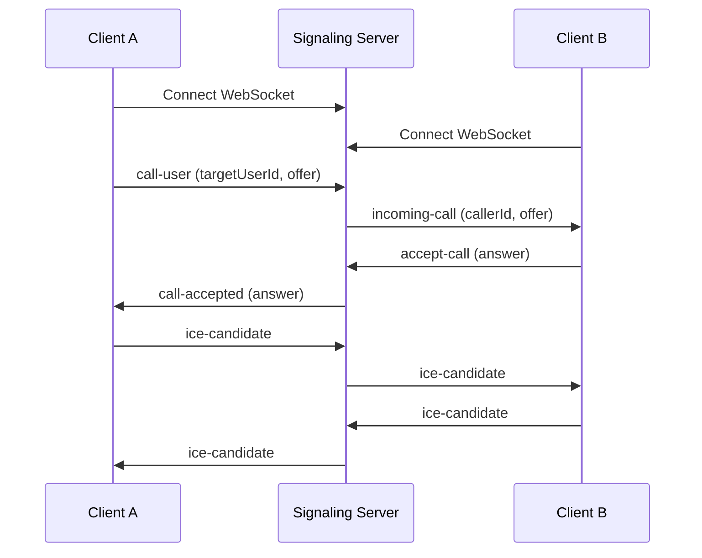
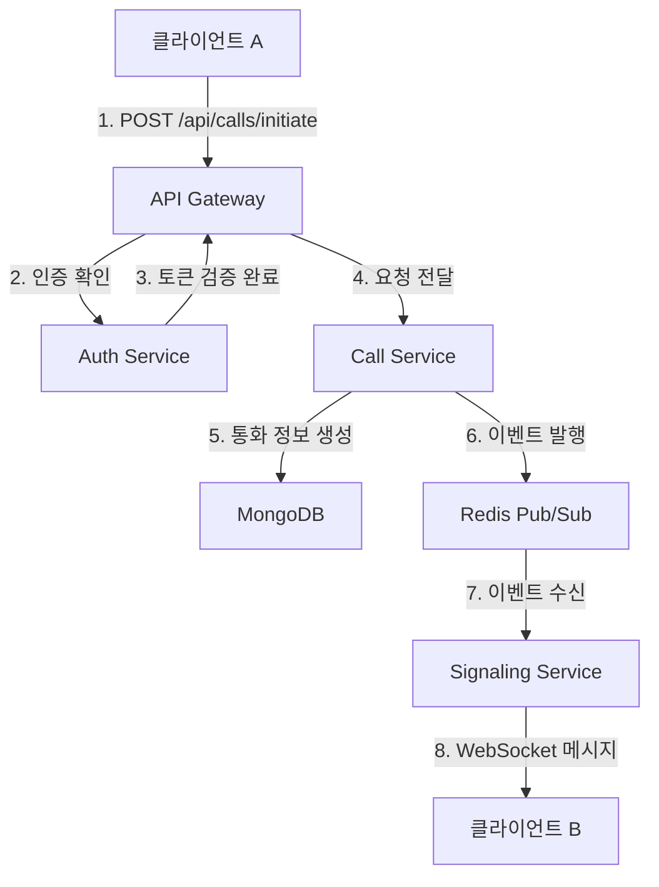
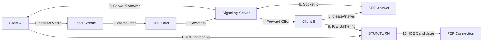

# VOIP 서버 기술 명세서

## 목차
1. [개요](#1-개요)
2. [시스템 아키텍처](#2-시스템-아키텍처)
3. [기술 스택](#3-기술-스택)
4. [서비스 컴포넌트 상세](#4-서비스-컴포넌트-상세)
5. [데이터 플로우](#5-데이터-플로우)
6. [API 명세](#6-api-명세)
7. [보안 아키텍처](#7-보안-아키텍처)
8. [배포 아키텍처](#8-배포-아키텍처)

---

## 1. 개요

### 1.1 프로젝트 개요
- **프로젝트명**: WebRTC 기반 VOIP 서버 시스템
- **목적**: 실시간 음성/영상 통화를 지원하는 확장 가능한 백엔드 시스템 구축
- **주요 기능**:
  - WebRTC 기반 P2P 음성/영상 통화
  - 실시간 시그널링 처리
  - 사용자 인증 및 권한 관리
  - 통화 기록 및 녹음
  - 미디어 서버를 통한 다자간 통화

### 1.2 기술적 목표
- **확장성**: 수평적 확장이 가능한 마이크로서비스 아키텍처
- **고가용성**: 99.9% 이상의 가동률 목표
- **저지연**: 100ms 이하의 시그널링 지연
- **보안**: E2E 암호화 및 JWT 기반 인증

---

## 2. 시스템 아키텍처

### 2.1 전체 아키텍처 다이어그램

```
┌─────────────────────────────────────────────────────────────────┐
│                        Load Balancer (Nginx)                    │
│                         - SSL Termination                       │
│                         - WebSocket Proxy                       │
└────────────────────┬───────────────────┬───────────────────────┘
                     │                   │
        ┌────────────▼──────────┐ ┌─────▼──────────────┐
        │   Signaling Server    │ │   Media Server     │
        │     (Node.js)         │ │   (Kurento/Janus)  │
        │   - Socket.io         │ │   - WebRTC         │
        │   - REST API          │ │   - Recording      │
        └───────────┬───────────┘ └────────┬───────────┘
                    │                      │
        ┌───────────▼───────────────────────▼──────────┐
        │              Message Queue (Redis)           │
        │          - Pub/Sub for real-time events      │
        └───────────┬──────────────────────────────────┘
                    │
        ┌───────────▼───────────┐ ┌────────────────────┐
        │    MongoDB Cluster    │ │   Session Store    │
        │   - User Data         │ │    (Redis)         │
        │   - Call History      │ │   - JWT Tokens     │
        │   - Voice Messages    │ │   - User Sessions  │
        └───────────────────────┘ └────────────────────┘
```

### 2.2 마이크로서비스 구조

| 서비스 | 포트 | 역할 |
|--------|------|------|
| API Gateway | 3000 | 모든 외부 요청의 진입점, 라우팅 및 인증 |
| Auth Service | 3001 | 사용자 인증, JWT 토큰 발급 |
| User Service | 3002 | 사용자 프로필 관리 |
| Call Service | 3003 | 통화 관리 및 기록 |
| Signaling Service | 3004 | WebRTC 시그널링 처리 |
| Media Service | 3005 | 미디어 스트림 처리 및 녹음 |
| Notification Service | 3006 | 푸시 알림 및 이메일 발송 |

---

## 3. 기술 스택

### 3.1 백엔드 기술
- **언어**: Node.js (v18.x)
- **프레임워크**: Express.js
- **실시간 통신**: Socket.io
- **데이터베이스**: 
  - MongoDB (사용자 데이터, 통화 기록)
  - Redis (세션, 캐시, Pub/Sub)

### 3.2 미디어 처리
- **WebRTC 서버**: Kurento Media Server / Janus Gateway
- **STUN/TURN**: Coturn
- **코덱**: 
  - 오디오: Opus, PCMU
  - 비디오: VP8, H.264

### 3.3 인프라 및 DevOps
- **컨테이너**: Docker, Docker Compose
- **오케스트레이션**: Kubernetes
- **CI/CD**: GitHub Actions
- **모니터링**: Prometheus, Grafana, ELK Stack
- **API Gateway**: Nginx

---

## 4. 서비스 컴포넌트 상세

### 4.1 Signaling Service

#### 4.1.1 주요 기능
- WebSocket 연결 관리
- SDP Offer/Answer 교환
- ICE Candidate 교환
- 통화 상태 관리
- 참가자 presence 관리

#### 4.1.2 이벤트 플로우



#### 4.1.3 Socket.io 이벤트

| 이벤트명 | 방향 | 설명 | 페이로드 |
|---------|------|------|----------|
| `call-user` | Client → Server | 통화 시작 요청 | `{targetUserId, callType, offer}` |
| `incoming-call` | Server → Client | 수신 통화 알림 | `{roomId, callerId, callerName, callType, offer}` |
| `accept-call` | Client → Server | 통화 수락 | `{roomId, answer}` |
| `reject-call` | Client → Server | 통화 거절 | `{roomId, reason}` |
| `end-call` | Client → Server | 통화 종료 | `{roomId}` |
| `ice-candidate` | Bidirectional | ICE 후보 교환 | `{targetUserId, candidate, roomId}` |
| `toggle-audio` | Client → Server | 음소거 토글 | `{roomId, enabled}` |
| `toggle-video` | Client → Server | 비디오 토글 | `{roomId, enabled}` |

### 4.2 Media Service

#### 4.2.1 주요 기능
- WebRTC 미디어 파이프라인 관리
- 녹음 기능
- 트랜스코딩
- 대역폭 적응
- 미디어 품질 모니터링

#### 4.2.2 미디어 파이프라인

```
Client A                    Kurento Media Server                    Client B
    │                              │                                    │
    ├──── WebRTC Endpoint A ───────┤                                    │
    │                              │                                    │
    │                         ┌────┴────┐                               │
    │                         │Pipeline │                               │
    │                         └────┬────┘                               │
    │                              │                                    │
    │                    ┌─────────┴──────────┐                        │
    │                    │                    │                        │
    │              ┌─────┴─────┐       ┌─────┴─────┐                  │
    │              │ Endpoint A │       │ Endpoint B │                 │
    │              └─────┬─────┘       └─────┬─────┘                  │
    │                    │                    │                        │
    │                    │     ┌───────┐      │                        │
    │                    └────►│Recorder│◄────┘                        │
    │                          └───────┘                               │
    │                                                                  │
    └──────────────────────────────────────────── WebRTC Endpoint B ───┘
```

### 4.3 Call Service

#### 4.3.1 데이터 모델

```javascript
// Call History Schema
{
  callId: String (UUID),
  callerId: ObjectId (ref: User),
  calleeId: ObjectId (ref: User),
  callType: String (enum: ['audio', 'video']),
  startTime: Date,
  endTime: Date,
  duration: Number (seconds),
  status: String (enum: ['completed', 'missed', 'rejected', 'failed']),
  recordings: [{
    recordingId: String,
    fileName: String,
    duration: Number,
    size: Number,
    createdAt: Date
  }],
  quality: {
    avgAudioQuality: Number,
    avgVideoQuality: Number,
    connectionIssues: Number
  }
}
```

---

## 5. 데이터 플로우

### 5.1 통화 시작 플로우



### 5.2 미디어 스트림 플로우



---

## 6. API 명세

### 6.1 인증 API

#### POST /api/auth/register
사용자 회원가입

**Request Body:**
```json
{
  "email": "user@example.com",
  "password": "password123",
  "name": "John Doe"
}
```

**Response:**
```json
{
  "userId": "507f1f77bcf86cd799439011",
  "token": "eyJhbGciOiJIUzI1NiIsInR5cCI6IkpXVCJ9...",
  "refreshToken": "eyJhbGciOiJIUzI1NiIsInR5cCI6IkpXVCJ9..."
}
```

#### POST /api/auth/login
사용자 로그인

**Request Body:**
```json
{
  "email": "user@example.com",
  "password": "password123"
}
```

### 6.2 통화 API

#### POST /api/calls/initiate
통화 시작

**Headers:**
```
Authorization: Bearer <token>
```

**Request Body:**
```json
{
  "targetUserId": "507f1f77bcf86cd799439012",
  "callType": "video"
}
```

**Response:**
```json
{
  "success": true,
  "callId": "550e8400-e29b-41d4-a716-446655440000",
  "message": "Call initiated successfully"
}
```

#### GET /api/calls/history
통화 기록 조회

**Query Parameters:**
- `page`: 페이지 번호 (기본값: 1)
- `limit`: 페이지당 항목 수 (기본값: 20)
- `type`: 통화 유형 필터 (audio/video)

**Response:**
```json
{
  "calls": [
    {
      "callId": "550e8400-e29b-41d4-a716-446655440000",
      "callerId": {
        "id": "507f1f77bcf86cd799439011",
        "name": "John Doe",
        "avatar": "https://..."
      },
      "calleeId": {
        "id": "507f1f77bcf86cd799439012",
        "name": "Jane Smith",
        "avatar": "https://..."
      },
      "callType": "video",
      "startTime": "2024-01-15T10:30:00Z",
      "duration": 300,
      "status": "completed"
    }
  ],
  "pagination": {
    "page": 1,
    "limit": 20,
    "total": 150,
    "pages": 8
  }
}
```

---

## 7. 보안 아키텍처

### 7.1 인증 및 권한

#### 7.1.1 JWT 토큰 구조
```json
{
  "userId": "507f1f77bcf86cd799439011",
  "email": "user@example.com",
  "name": "John Doe",
  "role": "user",
  "iat": 1642339200,
  "exp": 1642425600
}
```

#### 7.1.2 토큰 관리
- **Access Token**: 15분 유효
- **Refresh Token**: 7일 유효
- **토큰 저장**: Redis (블랙리스트 관리)

### 7.2 통신 보안

#### 7.2.1 전송 계층 보안
- **HTTPS**: 모든 HTTP 통신에 TLS 1.2+ 적용
- **WSS**: WebSocket Secure 프로토콜 사용
- **DTLS**: WebRTC 미디어 스트림 암호화

#### 7.2.2 미디어 보안
```javascript
// WebRTC 보안 설정
const pcConfig = {
  iceServers: [{
    urls: 'turn:turn.example.com:3478',
    username: 'user',
    credential: 'password'
  }],
  iceTransportPolicy: 'relay', // TURN 서버만 사용
  bundlePolicy: 'max-bundle',
  rtcpMuxPolicy: 'require'
};
```

### 7.3 API 보안

#### 7.3.1 Rate Limiting
```javascript
// Rate Limiting 설정
const rateLimitConfig = {
  general: {
    windowMs: 15 * 60 * 1000, // 15분
    max: 100 // 최대 100 요청
  },
  auth: {
    windowMs: 15 * 60 * 1000,
    max: 5, // 로그인 시도 5회 제한
    skipSuccessfulRequests: true
  }
};
```

#### 7.3.2 입력 검증
- **SQL Injection 방지**: Parameterized queries
- **NoSQL Injection 방지**: MongoDB sanitize
- **XSS 방지**: Input sanitization
- **CSRF 방지**: CSRF tokens

---

## 8. 배포 아키텍처

### 8.1 컨테이너 구성

```yaml
# docker-compose.yml 구조
services:
  nginx:
    ports: ["80:80", "443:443"]
    
  api-gateway:
    scale: 2
    
  signaling-service:
    scale: 3
    
  media-service:
    scale: 2
    
  mongodb:
    replica_set: rs0
    
  redis:
    cluster: true
    
  kurento:
    scale: 2
```

### 8.2 Kubernetes 배포

#### 8.2.1 리소스 요구사항
| 서비스 | CPU (요청/제한) | 메모리 (요청/제한) | 레플리카 |
|--------|-----------------|-------------------|----------|
| API Gateway | 250m/500m | 256Mi/512Mi | 2 |
| Signaling Service | 500m/1000m | 512Mi/1Gi | 3 |
| Media Service | 1000m/2000m | 1Gi/2Gi | 2 |
| MongoDB | 1000m/2000m | 2Gi/4Gi | 3 |
| Redis | 500m/1000m | 1Gi/2Gi | 6 |

#### 8.2.2 Auto-scaling 정책
```yaml
# HPA (Horizontal Pod Autoscaler) 설정
metrics:
  - type: Resource
    resource:
      name: cpu
      target:
        type: Utilization
        averageUtilization: 70
  - type: Resource
    resource:
      name: memory
      target:
        type: Utilization
        averageUtilization: 80
  - type: Pods
    pods:
      metric:
        name: websocket_connections
      target:
        type: AverageValue
        averageValue: "1000"
```

### 8.3 모니터링 및 로깅

#### 8.3.1 메트릭 수집
- **시스템 메트릭**: CPU, Memory, Disk, Network
- **애플리케이션 메트릭**:
  - HTTP 요청 응답 시간
  - WebSocket 연결 수
  - 활성 통화 수
  - 통화 품질 지표

#### 8.3.2 로그 수집 및 분석
```
Filebeat → Logstash → Elasticsearch → Kibana
           ↓
        InfluxDB → Grafana (메트릭 시각화)
```

### 8.4 백업 및 복구

#### 8.4.1 백업 전략
- **MongoDB**: 일일 전체 백업, 시간별 증분 백업
- **Redis**: 15분마다 RDB 스냅샷
- **녹음 파일**: S3에 실시간 업로드
- **백업 보관**: 30일 (S3 Glacier로 아카이빙)

#### 8.4.2 복구 절차
1. 서비스 중단 공지
2. 백업 데이터 복원
3. 데이터 무결성 검증
4. 서비스 재시작
5. 헬스체크 및 모니터링

---

## 부록 A: 에러 코드

| 코드 | 설명 | HTTP 상태 |
|------|------|-----------|
| AUTH001 | 잘못된 인증 정보 | 401 |
| AUTH002 | 토큰 만료 | 401 |
| AUTH003 | 권한 없음 | 403 |
| CALL001 | 사용자 오프라인 | 404 |
| CALL002 | 사용자 통화 중 | 409 |
| CALL003 | 통화 시작 실패 | 500 |
| MEDIA001 | 미디어 서버 연결 실패 | 503 |
| MEDIA002 | 녹음 시작 실패 | 500 |

## 부록 B: 환경 변수

```bash
# 서버 설정
NODE_ENV=production
PORT=3000

# 데이터베이스
MONGODB_URL=mongodb://localhost:27017/voip
REDIS_HOST=localhost
REDIS_PORT=6379

# 인증
JWT_SECRET=your-secret-key
JWT_EXPIRES_IN=15m
REFRESH_TOKEN_EXPIRES_IN=7d

# 미디어 서버
KURENTO_URL=ws://localhost:8888/kurento
STUN_SERVER=stun:stun.l.google.com:19302
TURN_URL=turn:turn.example.com:3478

# 모니터링
ELASTICSEARCH_URL=http://localhost:9200
PROMETHEUS_PORT=9090
```