# VOIP 시스템 통합 플로우 다이어그램

## 1. 시스템 전체 구조도

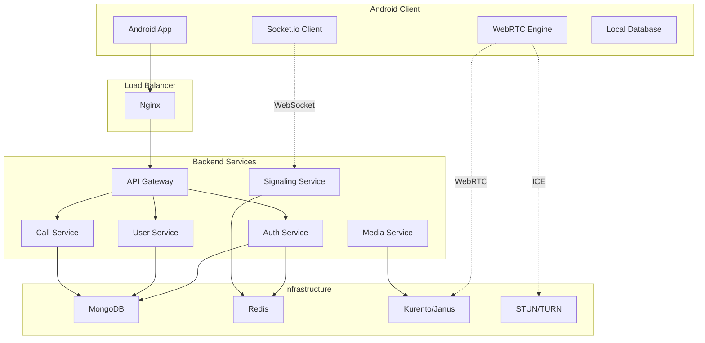

## 2. 사용자 인증 플로우

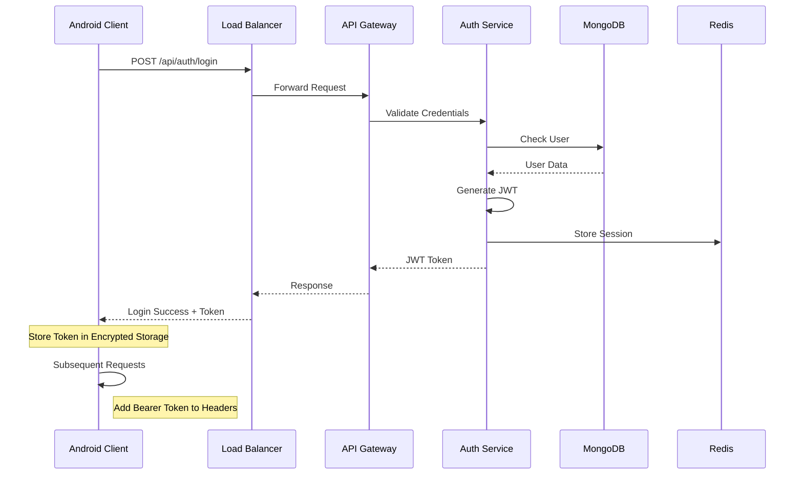

## 3. 통화 시작 플로우

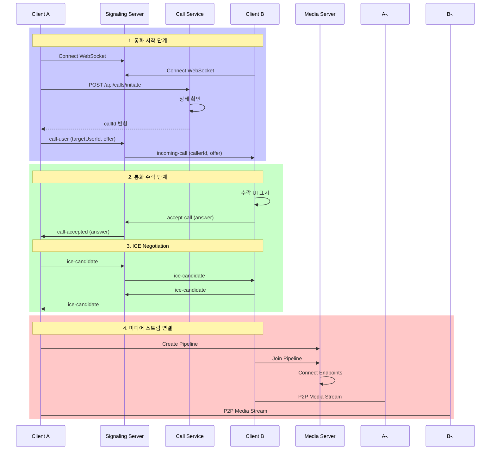

## 4. WebRTC 연결 상세 플로우

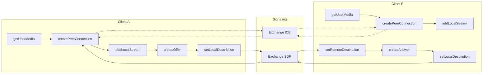

## 5. 통화 종료 플로우

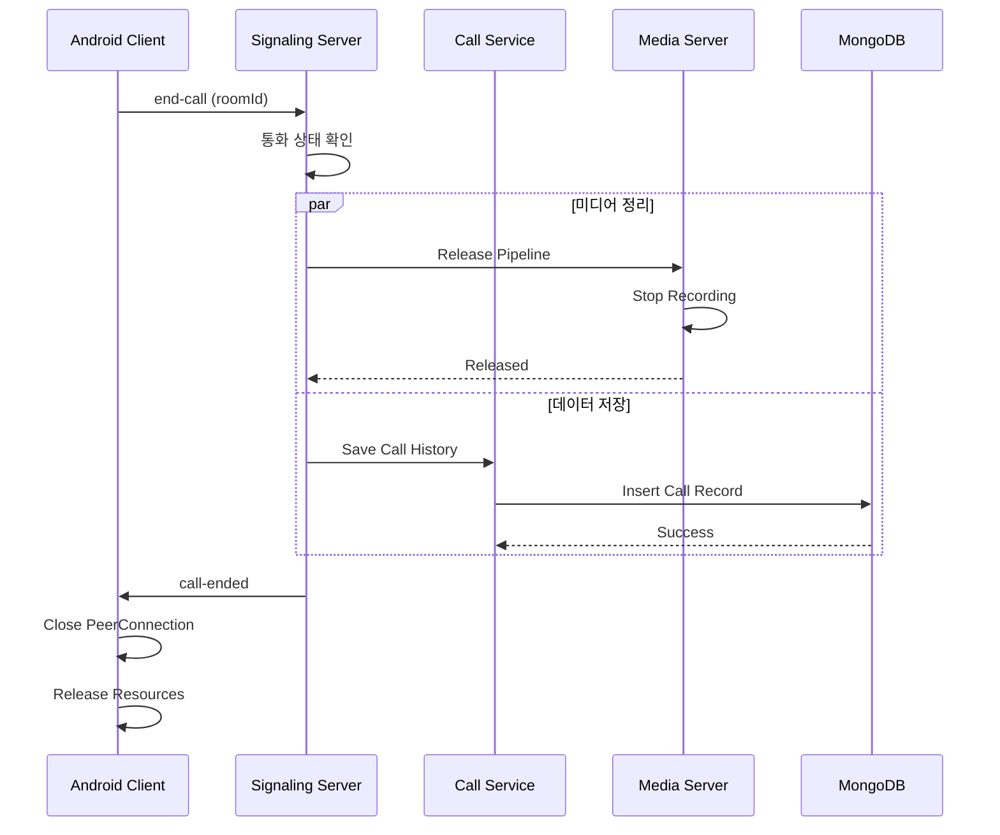

## 6. 오류 처리 플로우

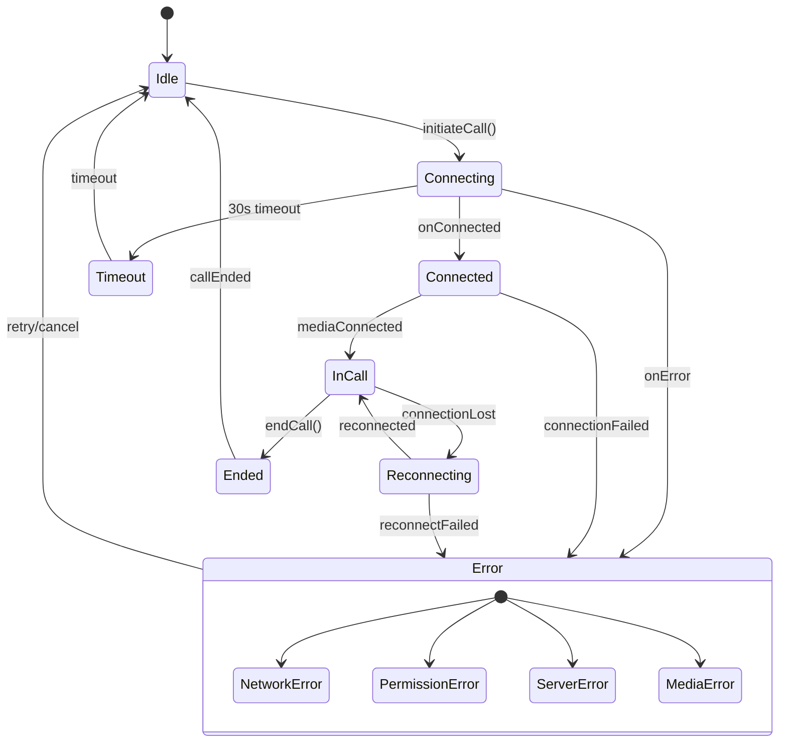

## 7. 푸시 알림을 통한 수신 통화 플로우

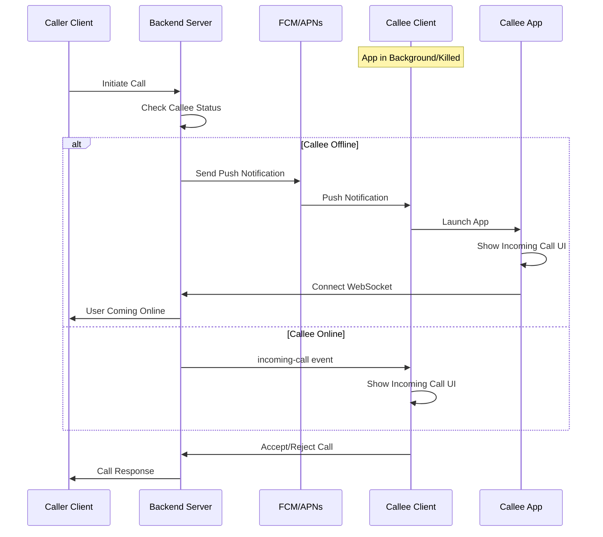

## 8. 네트워크 품질 적응 플로우

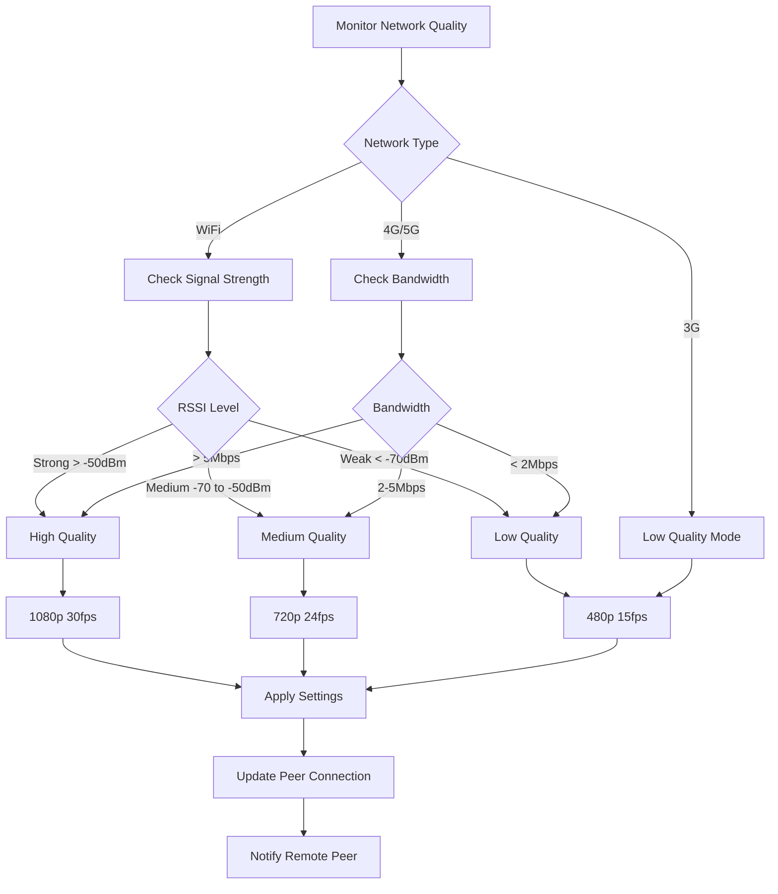

## 9. 데이터 동기화 플로우

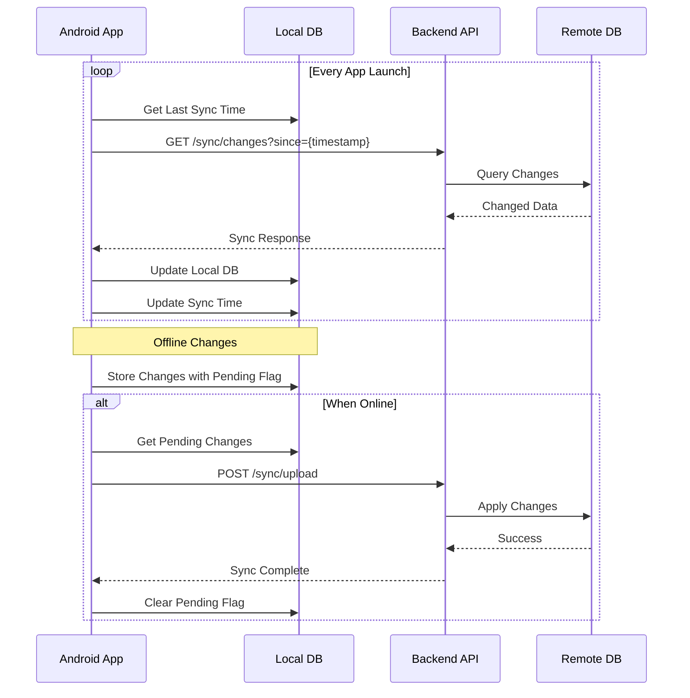

## 10. 보안 통신 플로우

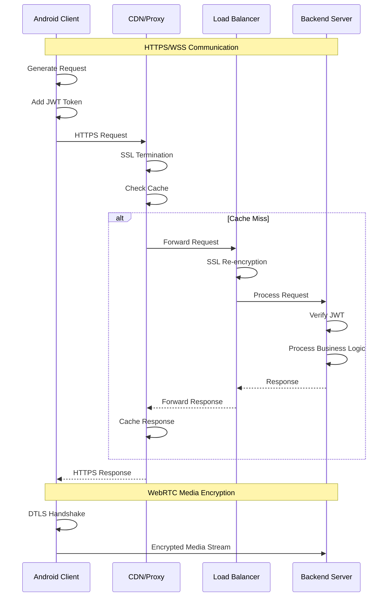

## 11. 모니터링 및 분석 플로우

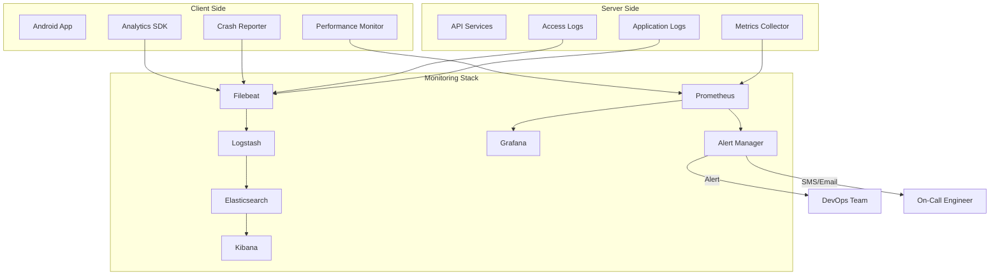

## 12. 장애 복구 플로우

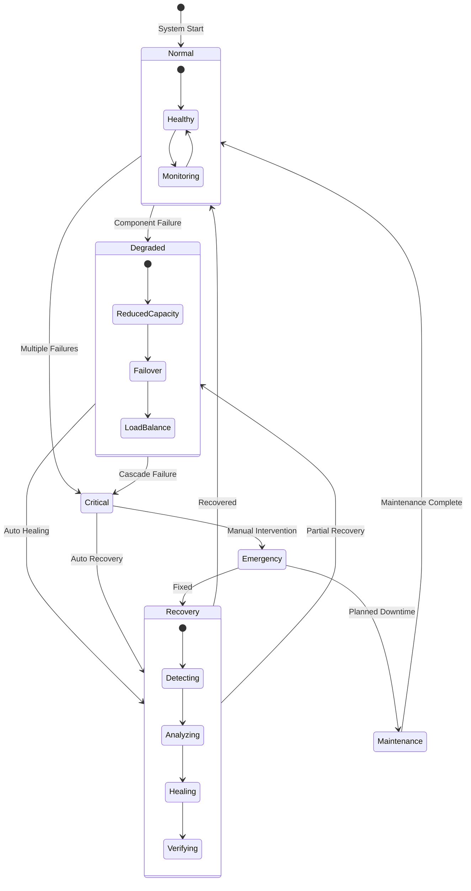

## 13. 확장성 관리 플로우

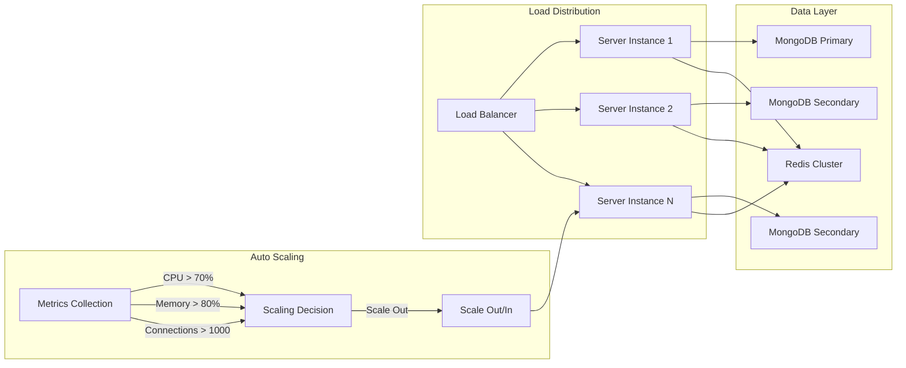

## 14. CI/CD 파이프라인 플로우

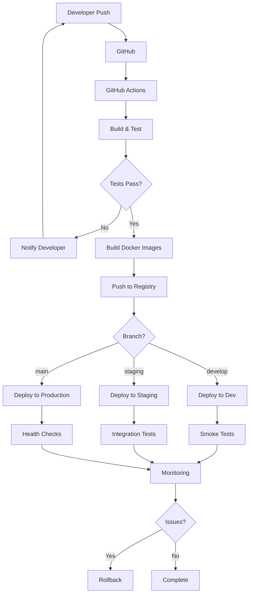

## 15. 통합 시스템 상태 플로우

```mermaid
graph TB
    subgraph "Android Client States"
        AC1[Idle]
        AC2[Authenticating]
        AC3[Online]
        AC4[In Call]
        AC5[Background]
    end
    
    subgraph "Server States"
        SS1[User Offline]
        SS2[User Online]
        SS3[User Busy]
        SS4[Call Active]
    end
    
    subgraph "Media States"
        MS1[No Media]
        MS2[Connecting]
        MS3[Connected]
        MS4[Recording]
    end
    
    AC1 -->|Login| AC2
    AC2 -->|Success| AC3
    AC3 -->|Make Call| AC4
    AC4 -->|End Call| AC3
    AC3 -->|App Background| AC5
    AC5 -->|App Foreground| AC3
    
    SS1 -->|User Login| SS2
    SS2 -->|Start Call| SS3
    SS3 -->|Call Connected| SS4
    SS4 -->|Call Ended| SS2
    SS2 -->|User Logout| SS1
    
    MS1 -->|Call Start| MS2
    MS2 -->|WebRTC Connected| MS3
    MS3 -->|Start Record| MS4
    MS4 -->|Stop Record| MS3
    MS3 -->|Call End| MS1
```

---

## 시스템 통합 요약

### 주요 통합 포인트

1. **클라이언트-서버 통신**
   - RESTful API (HTTPS)
   - WebSocket (실시간 시그널링)
   - WebRTC (P2P 미디어)

2. **인증 및 세션 관리**
   - JWT 기반 인증
   - Redis 세션 스토어
   - 자동 토큰 갱신

3. **실시간 통신**
   - Socket.io 양방향 통신
   - Redis Pub/Sub 이벤트 브로커
   - WebRTC 미디어 스트림

4. **데이터 일관성**
   - MongoDB 트랜잭션
   - 낙관적 동시성 제어
   - 이벤트 소싱 패턴

5. **고가용성**
   - 로드 밸런싱
   - 자동 장애 복구
   - 서비스 메시 아키텍처

### 성능 최적화 전략

1. **클라이언트 최적화**
   - 배터리 소비 최소화
   - 네트워크 적응형 품질
   - 로컬 캐싱

2. **서버 최적화**
   - 수평적 확장
   - 캐싱 전략
   - 데이터베이스 인덱싱

3. **네트워크 최적화**
   - CDN 활용
   - 압축 및 최소화
   - Connection Pooling

### 보안 고려사항

1. **전송 보안**
   - TLS 1.3
   - Certificate Pinning
   - DTLS for WebRTC

2. **애플리케이션 보안**
   - JWT 토큰 관리
   - 입력 검증
   - Rate Limiting

3. **데이터 보안**
   - 암호화된 저장소
   - E2E 암호화
   - GDPR 준수